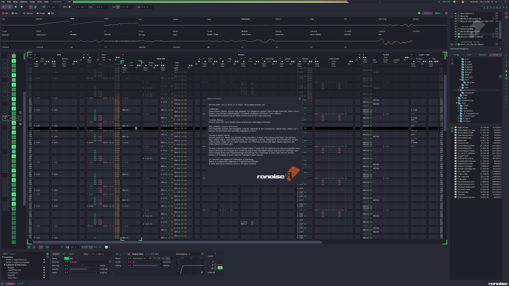
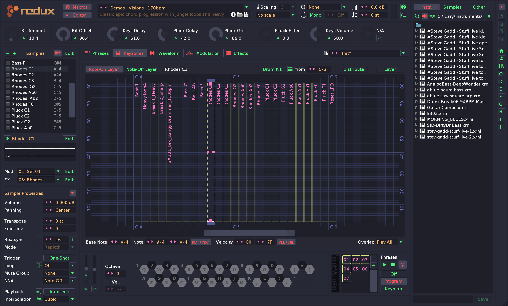

# Dracula for [ReNoise](http://renoise.com)

> A dark theme for [ReNoise](http://renoise.com) & [Redux](https://www.renoise.com/products/redux).

ReNoise

Redux

(NOTE: HDPI screenshots at 150% UI up scale on Windows 10 at 3840x2160)

## Install

See [INSTALL.md](./INSTALL.md)

## Team

This theme is maintained by the following person(s) and a bunch of [awesome contributors](https://github.com/dracula/template/graphs/contributors).

| ---
[B00MER](https://github.com/molotovbliss)

## License

The MIT License (MIT) see LICENSE
